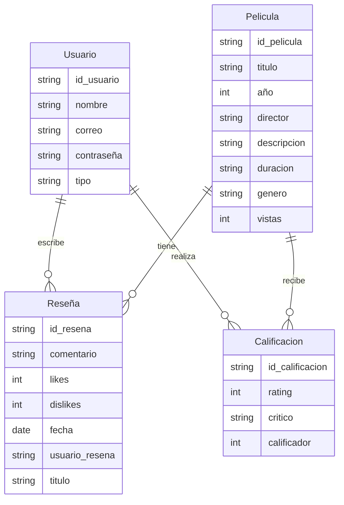
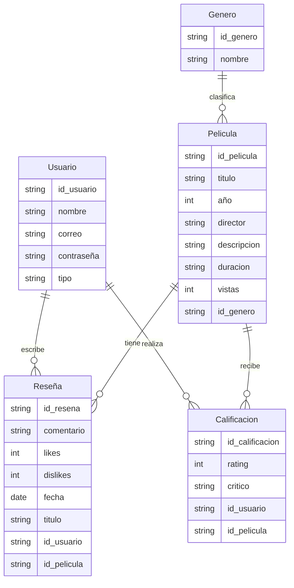
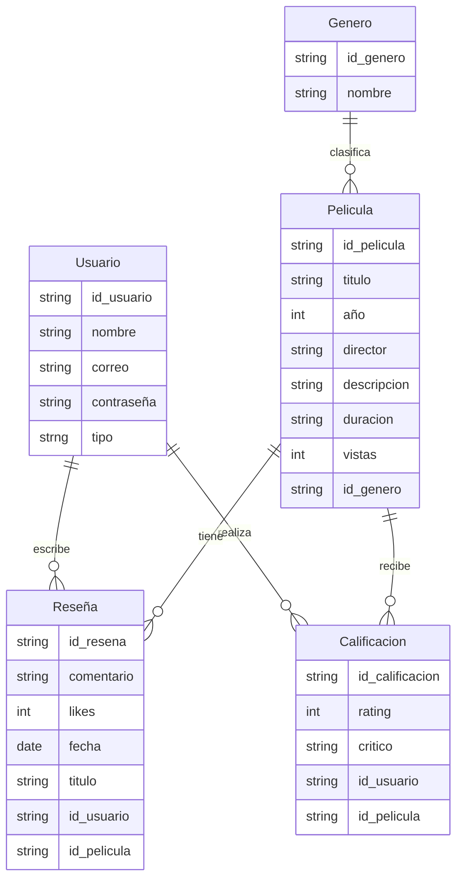

<h1 align="center">Freelance Project</h1>


<h3 align="center">

Juan  Fernando Umaña Barragan
<br>
Gerson Chapparro 
<br>


<br>
<br>


S1

<br>
<br>
<br>


PEDRO FELIPE GÓMEZ BONILLA

<br>
<br>
<br>


CAMPUSLANDS
<br>
<br>
<br>

Cajasan
<br>
<br>
<br>

RUTA Nodejs
<br>
<br>
<br>

Bucaramanga
<br>
<br>
<br>

2025

</h3>


---

<br>
<br>
<br>
<br>


## 📑 Tabla de Contenidos
| Índice | Sección                                |
|--------|----------------------------------------|
| 1      | **Introducción**                       |
| 2      | **Caso de Estudio**                    |
| 3      | **Requerimientos entregados en el caso de estudio** |
| 4      | **Objetivos**                          |
| 5      | **Elementos del documento**            |
| 7      | **Planificación**                      |
| 8      | **Construcción del Modelo Conceptual** |
| 9      | **Descripción**                        |
| 11     | **Gráfica**                            |
| 12     | **Descripción Técnica**                |
| 13     | **Construcción del Modelo Lógico**     |
| 14     | **Descripción**                        |
| 16     | **Gráfica**                            |
| 17     | **Descripción Técnica**                |
| 18     | **Normalización del Modelo Lógico**    |
| 19     | **Primera Forma Normal (1FN)**         |
| 20     | **Descripción**                        |
| 21     | **Gráfica**                            |
| 22     | **Descripción Técnica**                |
| 23     | **Segunda Forma Normal (2FN)**         |
| 24     | **Descripción**                        |
| 25     | **Gráfica**                            |
| 26     | **Descripción Técnica**                |
| 27     | **Tercera Forma Normal (3FN)**         |
| 28     | **Descripción**                        |
| 29     | **Gráfica**                            |
| 30     | **Descripción Técnica**                |
| 31     | **Construcción del Modelo Físico**     |
| 32     | **Descripción**                        |
| 34     | **Código Documentado**                 |
| 35     | **Descripción Técnica**                |
| 36     | **Diagrama E-R**                       |
| 37     | **Descripción Técnica**                |
| 38     | **Referencias**                        |

---
<br>
<br>
<br>


# Introducción

El presente documento tiene como objetivo exponer de forma estructurada y detallada la solución a una problemática específica relacionada con el diseño e implementación de una base de datos organizada y eficiente, usando Mongodb como herramienta. Esta solución se desarrolla siguiendo una metodología que abarca todas las fases esenciales del proceso de organización y estructuración de datos, desde el análisis inicial hasta la construcción final del modelo físico.

La estructura del documento se organiza en distintas secciones que permiten abordar cada aspecto siguiendo el modelo entidad relación (e-r), el desarrollo del caso de estudio, objetivos, de manera clara y progresiva. En primer lugar, se presenta una introducción general al proyecto, estableciendo el contexto y el propósito de este. Posteriormente, se describe la situación que da origen al estudio, permitiendo comprender los requerimientos fundamentales del sistema a desarrollar.
A continuación, se lleva a cabo el diseño del modelo conceptual, que representa de forma abstracta las entidades involucradas, sus atributos y las relaciones entre ellas de manera inicial. Esta etapa es acompañada por representaciones gráficas y explicaciones técnicas que fundamentan las decisiones de modelado (modelo conceptual, modelo lógico y modelo físico).
Seguidamente, se construye el modelo lógico, el cual traduce el diseño conceptual en una estructura más concreta y alineada con los principios de los sistemas  bases de datos, en ese caso (NOSQL) . Este modelo se somete a un proceso de normalización, pasando por las tres formas normales (1FN, 2FN y 3FN), con el objetivo de optimizar la organización de los datos, eliminar redundancias y garantizar la integridad de los datos.
Finalmente, se desarrolla el modelo físico, que materializa el diseño lógico en instrucciones que se van a implementar en la base de datos de Mongodb. Este modelo incluye la  estructura de modelado de datos para bases de datos no relacionales . Todo esto es complementado con gráficas, fragmentos de código y descripciones técnicas que ilustran la funcionalidad del sistema.
En conjunto, este documento busca ofrecer una visión integral, lógica y comprensible del proceso de diseño y construcción de una base de datos, sirviendo como guía para la implementación de soluciones similares en este caso, para el caso de estudio de “Karen flix”.


<br>
<br>
<br>
<br>


# Caso de Estudio

- El proyecto consiste En la creación de una pagina web de peliculas utilizando fron-end y backend , junto con mongodb y bases de datos Nosql, ddonde existan dos perfiles, usuario y administraador, donde el primero  pueda, comentar acerca de las peiculas, brindarles una calificacion, ver las peliculas mas vistas , las mejor calificadas , que puedan visualizar su categoría, y que tengan un registro u inicio de sesion.

- El proyecto busca crear un sistema con un flujo eficiente que pueda limitar y permitir al usuario sus funciones basicas para ver información , escribir comentarios , entre otros, y , por otra parte permitir al administrador gestionar categorias y peliculas.


## **Funcionalidades requeridas**

1. **Gestión de usuarios**

   - Registro, inicio de sesión y autenticación mediante JWT.

   - Roles: usuario y administrador.

   - Los administradores pueden gestionar categorías y aprobar películas.

1. **Gestión de películas y series**

   - CRUD de películas/series (solo administradores aprueban nuevas entradas).

   - Validación para evitar títulos repetidos.

   - Atributos mínimos: título, descripción, categoría, año, imagen opcional.

1. **Gestión de reseñas y ratings**

   - Los usuarios pueden crear, editar y eliminar reseñas.

   - Cada reseña incluye: título, comentario, calificación numérica (1-10) -> (1-5) -> (1,1.1,1.2...5).

   - Los usuarios pueden dar **like/dislike** a reseñas de otros (no a las propias).

   - El sistema debe calcular un **ranking ponderado** de películas basado en calificaciones, likes/dislikes y fecha de reseña.

1. **Categorías**

   - CRUD de categorías (ejemplo: Anime, Ciencia Ficción, Superhéroes, Fantasía) (Min 4).

   - Solo administradores pueden gestionarlas.

1. **Ranking y listados**

   - Listado de películas con ordenamiento por **popularidad y ranking**.

   - Filtrado por categoría.

   - Vista de detalle con información y reseñas asociadas.


## **Especificaciones técnicas obligatorias**

1. **Backend (Node.js + Express)**

   - Uso obligatorio de dotenv, express, express-rate-limit, express-validator, mongodb, semver, swagger-ui-express, passport-jwt, jsonwebtoken, bcrypt.

   - MongoDB con operaciones transaccionales para garantizar consistencia.

   - Arquitectura modular y escalable.

   - Manejo de errores centralizado y códigos HTTP correctos.

   - Debe estar desarrollado en Node.js con Express.

   - Uso de variables de entorno para credenciales y configuración (archivo .env).

   - Modularización del código (separar rutas, controladores, modelos y configuración).

   - Validaciones en las rutas usando express-validator.

   - Manejo adecuado de errores y envío de respuestas con los códigos HTTP correctos.

   - Configuración de CORS para permitir la conexión desde el frontend.

     **Documentación en el README con: ** 

     - Explicación del proyecto.
     - Requerimientos de instalación.
     - Variables de entorno necesarias.
     - Ejemplos de endpoints y cómo probarlos.
     - Link al repositorio del frontend.

1. **Frontend**

   - HTML, CSS y JavaScript puro.

   - Pantallas mínimas: Inicio, Registro/Login, Listado de películas, Detalle de película, Panel admin.

   - Debe consumir los endpoints del backend.

   - Interfaz amigable y responsive para realizar todas las operaciones (crear, leer, actualizar, eliminar).

   - Mostrar mensajes de validación o error provenientes del backend.

   - Repositorio separado del backend.

1. **Documentación (README del backend)**

   - Descripción del proyecto y temática elegida.

   - Tecnologías usadas.

   - Pasos para instalar y ejecutar.

   - Ejemplos de endpoints y cómo consumirlos.

   - Link al repositorio del frontend.

1. **Video de entrega**

   - Duración máxima: **10 minutos**.

   - Deben aparecer todos los integrantes en cámara.

   - Mostrar brevemente el código del backend.

   - Mostrar el funcionamiento completo del frontend.


### Estructura del Sistema
  
  El sistema se encuentra dividido en las siguientes entidades principales:

- Usuario

- Calificacion

- Pelicula

- Reseña


<br>
<br>
<br>
<br>


# Objetivos 

Se planea desarrollar una api que contenga la logica del negocio desarrollada correctamente y la información necesaria para que pueda ser extraida correctamente del front-end, con su respectivo jwt, por otro lado tener un front-end fluido y con buen diseño el cual cumpla con lo que se nos pide en el caso de estudio.

#### 1.Realizar un buen planteamiento de la base de datos

#### 2. Establecer el modelo e-r para la base de datos 

#### 3.Cumplir con la normalizacion de la base de datos

#### 4. Finalizar la documentación de la base de datos

#### 5. Que la base de datos se pueda integrar correctamente al proyecto

### 6. Poder desarrollar la logica de negocio de la mejor manera posible en el backend

### 7. Poder extraer la informacion correctamente en el front-end y cumplir con el diseño deseado 


<br>
<br>
<br>


<br>
<br>
<br>


<br>
<br>

# Planificación

## Diagrama E-R

### Descripción

Un diagrama ER (Entidad-Relación) es una herramienta visual que se utiliza en el diseño de bases de datos para representar de forma clara y estructurada los elementos clave del sistema de información. Este tipo de diagrama permite modelar los datos que serán almacenados, así como la forma en que se relacionan entre sí, antes de crear la base de datos. Ayuda a los analistas, diseñadores y desarrolladores a entender cómo se organiza la información, qué entidades intervienen, qué atributos poseen y cómo se conectan unas con otras.


## Construcción del Modelo Conceptual

Descripción
Un modelo conceptual en bases de datos es una representación, que describe las entidades, atributos y relaciones entre ellas en un negocio determinado, sin entrar en detalles de implementación tecnológica más específica. Su objetivo es comunicar la estructura de datos de manera clara y comprensible para los stakeholders, incluso aquellos sin conocimientos técnicos, y servir como base para el diseño lógico y físico de la base de datos.

Además, el modelo conceptual actúa como un puente entre los requerimientos del negocio y el diseño lógico y físico de la base de datos, sirviendo como punto de partida para construir modelos más detallados que ya consideren el tipo de base de datos a utilizar, la normalización y otros aspectos tecnológicos.

#### Descripción


### Descripción Técnica

Aqui se buscó el inicio del palanteamiento de la estructura que se busca en la cual exista un usuario elcual tenga un tipo ya sea usuario corriente o administrador, exista una coleccion de peliculas , la cual conntenga la data a extraer, la coleccion de comentarios y una calificacion.


## Grafica



## Construcción del Modelo Logico


### Descripción
Un modelo lógico de base de datos es una representación más detallada y estructurada del modelo conceptual, en la que se definen de manera precisa las entidades, sus atributos, y las relaciones entre ellas, así como aspectos técnicos como los identificadores únicos , para este modelo con MongoDB no se usaron llaves primareas o foraneas, se hizo referencia a esto mediante ids repetidos de referencia a llaves entre colecciones. A diferencia del modelo conceptual, el modelo lógico ya toma en cuenta cómo los datos serán organizados y estructurados dentro de un sistema de gestión de bases de datos.

Finalmente, hay que tener en cuenta que para realizar el modelo lógico, se necesita la siguiente estructura, En la cuál desaparecen los verbos, las entidades se vuelven tablas y los atributos, columnas


# Descripción Técnica

Aqui se realizó lo ya establecido en el modelo conceptual inicial, sin embargo se empezaron a utilizar ids o foreign keys ( las cuales en este caso son referencias en mongodb) para conectar los datos y se empezaron a realizar relaciones ya sea de uno a uno, uno a muchos o muchos a muchos para luego poder realizar la respectima normalización y estructuración completa de los datos.


## Entidades Antes de la normalización

## Usuario

### id_usuario (PK)

### nombre

### correo

### tipo 

### contraseña

## Película

### id_pelicula (PK)

### titulo

### año

### director

### descripcion

### duracion

### genero

### vistas


## Reseña

### id_resena (PK)

### comentario

### likes

### fecha

### titulo

### id_usuario (FK )

### id_pelicula (FK)

## Calificación

### id_calificacion (PK)

### rating

### critico

### calificador

### id_usuario (FK)

### id_pelicula (FK)

# Normalización del Modelo Lógico

<br>
<br>


# Primera Forma Normal (1FN)
### Descripción

La Primera Forma Normal (1FN) es el proceso de normalización de bases de datos, el cual, establece que todos los atributos de una tabla deben ser atómicos, es decir, deben contener valores únicos que no se pueden repetir, evitando que existan atributos multivaluados dentro de una sola entidad. Cuando se detecta que un atributo contiene múltiples valores, se debe reorganizar la estructura de la base de datos para cumplir con la 1FN. En estos casos, la solución consiste en separar el atributo multivaluado y colocarlo en una nueva tabla, estableciendo una relación adecuada entre distintas tablas.

# Gráfica



### Descripción Técnica

Para cumplir con la primera forma de normalización se eliminaron repeticiones de datos (campos multivaluados o anidados) para que todo sea atómico.

#### Cambios hechos:

- Se separo la parte de genero en la tabla de peliculas


<br>
<br>
<br>


# Segundo Forma Normal (2FN)
### Descripción

En bases de datos relacionales es un paso en el proceso de normalización que busca eliminar las dependencias parciales. Esto significa que, además de cumplir con los requisitos de la primera forma normal (1NF), las columnas no clave deben depender de la clave primaria completa y no solo de parte de ella.


### Gafica


### Descripción Técnica
Para cumplir con la segunda forma de normalización se eliminaron dependencias parciales: que ningún campo dependa solo de parte de una clave compuesta.


#### Cambios hechos:

- El diseño ya cumple con 2fn, ya que no hay dependencias parciales entre entidades


# Tercera Forma Normal (3FN)
### Descripción
La Tercera Forma Normal (3FN) es una forma normal en la normalización de bases de datos. Su objetivo principal es eliminar las dependencias transitivas, quiere decir que crea dependencia entre tablas lejanas y las tablas principales.

Cuando se evidencia que múltiples tablas tienen una gran dependencia, una de la otra, se busca eliminarla, integrando nuevas tablas que vuelvan a los datos aún más independientes.


### Descripción Técnica
Con esta forma de normalización se buscó, Eliminar dependencias transitivas: que ningún campo no clave dependa de otro campo no clave.


### Grafica


 


#### Cambios hechos:

- No existen dependencias transitivas hacia datos

# Construcción del Modelo Físico


### Descripción

El modelo físico en una base de datos es una representación detallada de cómo se implementará la estructura de la base de datos en el hardware y software, incluyendo las colecciones, inserciones, funciones, usuarios y consultas.

Finalmente, hay que tener en cuenta que para desarrollar el modelo físico, se deben realizar funciones, usuarios json schema, inserciones de datos y consultas dentro de MongoDB ( En este caso con Atlas) y en base a esto ejecutar comandos con los datos que se vana a incluir , de la siguiente manera:


## Codigo para las inserciones

``` js

db.pelicula.insertMany([
  {
    Title: "Duro de matar",
    Year: "1988",
    Released: "20 Jul 1988",
    Runtime: "132 min",
    Genre: "Accion",
    Poster: "https://m.media-amazon.com/images/M/MV5BMjI3.jpg",
    Plot: "Un policía intenta rescatar a rehenes de un rascacielos tomado por terroristas."
  },
  {
    Title: "Mad Max: Furia en el camino",
    Year: "2015",
    Released: "15 May 2015",
    Runtime: "120 min",
    Genre: "Accion",
    Poster: "https://m.media-amazon.com/images/M/MV5BMjA3.jpg",
    Plot: "En un futuro desértico, Max y Furiosa luchan por sobrevivir contra un tirano."
  },
  {
    Title: "Misión: Imposible",
    Year: "1996",
    Released: "22 May 1996",
    Runtime: "110 min",
    Genre: "Accion",
    Poster: "https://m.media-amazon.com/images/M/MV5BMzQw.jpg",
    Plot: "Un agente secreto es incriminado por la muerte de su equipo y debe limpiar su nombre."
  },
  {
    Title: "Gladiador",
    Year: "2000",
    Released: "05 May 2000",
    Runtime: "155 min",
    Genre: "Accion",
    Poster: "https://m.media-amazon.com/images/M/MV5BMTAx.jpg",
    Plot: "Un general romano busca vengar la muerte de su familia enfrentándose al corrupto emperador."
  },
  {
    Title: "John Wick",
    Year: "2014",
    Released: "24 Oct 2014",
    Runtime: "101 min",
    Genre: "Accion",
    Poster: "https://m.media-amazon.com/images/M/MV5BMTk0.jpg",
    Plot: "Un exasesino a sueldo regresa al mundo del crimen para vengar la muerte de su perro."
  },
  {
    Title: "Terminator 2: El juicio final",
    Year: "1991",
    Released: "03 Jul 1991",
    Runtime: "137 min",
    Genre: "Accion",
    Poster: "https://m.media-amazon.com/images/M/MV5BMjA2.jpg",
    Plot: "Un cyborg debe proteger a un niño destinado a liderar la resistencia contra las máquinas."
  },
  {
    Title: "Los Vengadores",
    Year: "2012",
    Released: "04 May 2012",
    Runtime: "143 min",
    Genre: "Accion",
    Poster: "https://m.media-amazon.com/images/M/MV5BMjI0.jpg",
    Plot: "Los superhéroes más poderosos de la Tierra deben unirse para detener una invasión alienígena."
  },
  {
    Title: "The Dark Knight",
    Year: "2008",
    Released: "18 Jul 2008",
    Runtime: "152 min",
    Genre: "Accion",
    Poster: "https://m.media-amazon.com/images/M/MV5BMTMx.jpg",
    Plot: "Batman enfrenta al Joker, un criminal que busca sumir a Ciudad Gótica en el caos."
  },
  {
    Title: "Rápidos y furiosos",
    Year: "2001",
    Released: "22 Jun 2001",
    Runtime: "106 min",
    Genre: "Accion",
    Poster: "https://m.media-amazon.com/images/M/MV5BMjEx.jpg",
    Plot: "Un policía se infiltra en el mundo de las carreras ilegales y se enfrenta a la lealtad y la justicia."
  },
  {
    Title: "Matrix",
    Year: "1999",
    Released: "31 Mar 1999",
    Runtime: "136 min",
    Genre: "Accion",
    Poster: "https://m.media-amazon.com/images/M/MV5BMjA3.jpg",
    Plot: "Un programador descubre que el mundo que conoce es una simulación creada por máquinas."
  },
  {
    Title: "300",
    Year: "2006",
    Released: "09 Mar 2007",
    Runtime: "117 min",
    Genre: "Accion",
    Poster: "https://m.media-amazon.com/images/M/MV5BMjA1.jpg",
    Plot: "El rey Leónidas lidera a 300 espartanos en la batalla contra el ejército persa."
  },
  {
    Title: "Misión: Imposible - Repercusión",
    Year: "2018",
    Released: "27 Jul 2018",
    Runtime: "147 min",
    Genre: "Accion",
    Poster: "https://m.media-amazon.com/images/M/MV5BMjM5.jpg",
    Plot: "Ethan Hunt y su equipo enfrentan las consecuencias de una misión fallida."
  },
  {
    Title: "Kill Bill: Volumen 1",
    Year: "2003",
    Released: "10 Oct 2003",
    Runtime: "111 min",
    Genre: "Accion",
    Poster: "https://m.media-amazon.com/images/M/MV5BMjYx.jpg",
    Plot: "Una asesina busca venganza contra su antiguo equipo que intentó matarla."
  },
  {
    Title: "Black Panther",
    Year: "2018",
    Released: "16 Feb 2018",
    Runtime: "134 min",
    Genre: "Accion",
    Poster: "https://m.media-amazon.com/images/M/MV5BMjU4.jpg",
    Plot: "El príncipe T'Challa regresa a Wakanda para reclamar el trono y defender a su nación."
  },
  {
    Title: "Misión Rescate",
    Year: "2020",
    Released: "24 Apr 2020",
    Runtime: "116 min",
    Genre: "Accion",
    Poster: "https://m.media-amazon.com/images/M/MV5BMjQw.jpg",
    Plot: "Un mercenario debe rescatar al hijo secuestrado de un capo internacional."
  },
  {
    Title: "Casino Royale",
    Year: "2006",
    Released: "17 Nov 2006",
    Runtime: "144 min",
    Genre: "Accion",
    Poster: "https://m.media-amazon.com/images/M/MV5BMjIz.jpg",
    Plot: "James Bond participa en un juego de póker de alto riesgo para detener a un financista del terrorismo."
  },
  {
    Title: "Iron Man",
    Year: "2008",
    Released: "02 May 2008",
    Runtime: "126 min",
    Genre: "Accion",
    Poster: "https://m.media-amazon.com/images/M/MV5BMjAx.jpg",
    Plot: "Un magnate de armas construye una armadura para convertirse en superhéroe."
  },
  {
    Title: "Capitán América: El Soldado de Invierno",
    Year: "2014",
    Released: "04 Apr 2014",
    Runtime: "136 min",
    Genre: "Accion",
    Poster: "https://m.media-amazon.com/images/M/MV5BMjQ2.jpg",
    Plot: "El Capitán América enfrenta a un nuevo enemigo conocido como el Soldado de Invierno."
  },
  {
    Title: "Mortal Kombat",
    Year: "2021",
    Released: "23 Apr 2021",
    Runtime: "110 min",
    Genre: "Accion",
    Poster: "https://m.media-amazon.com/images/M/MV5BMjM4.jpg",
    Plot: "Un grupo de luchadores es elegido para defender la Tierra en un torneo mortal."
  }
]);


``` 


## Descripción Técnica

Para realizar el modelo físico, se tuvieron en cuenta los datos de la base de datos normalizada hasta la tercera forma normal

# Referencias


